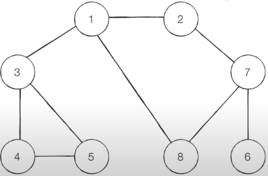

# DFS
Depth-First Search 로 stack을 이용한 깊이 우선탐색이다.     
다음 간선으로 넘어가기 전에 해당 간선을 완전탐색한다.  
아래의 그래프를 DFS로 순회하는 코드는 다음과 같다.


```python
def dfs(graph, node, visited):
    visited[node] = True
    print(node, end=' ')

    # node의 각 간선을 우선으로 완전 탐색
    for i in graph[node]:
        if not visited[i]:
            dfs(graph, i, visited)

if __name__ == '__main__':
    graph = [
        [],
        [2, 3, 8],
        [1, 7],
        [1, 4, 5],
        [3, 5],
        [3, 4],
        [7],
        [2, 6, 8],
        [1, 7]
    ]

    visited = [False] * 9

    dfs(graph, 1, visited)
```

## 정리
* 동작원리: 스택 
* 구현방법: 재귀함수

# BFS
Breadth-First Search 로 Queue를 이용한 너비 우선 탐색이다.       
해당 노드에 인접한 노드를 우선 탐색한다.     
탐색이 root에서 퍼져나가는 느낌의 너비 우선 탐색이다.        
아래의 그래프를 BFS로 순회하는 코드는 다음과 같다.


```python
from collections import deque

def bfs(graph, node, visited):
    # queue에 현재 노드를 추가
    queue = deque([node])
    visited[node] = True

    while queue:
        v = queue.popleft()
        print(v, end=' ')

        for i in graph[v]:
            if not visited[i]:
                queue.append(i)
                visited[i] = True

if __name__ == '__main__':
    graph = [
        [],
        [2, 3, 8],
        [1, 7],
        [1, 4, 5],
        [3, 5],
        [3, 4],
        [7],
        [2, 6, 8],
        [1, 7]
    ]

    visited = [False] * 9

    bfs(graph, 1, visited)
```

## 정리
* 동작원리: 큐
* 구현방법: 큐
