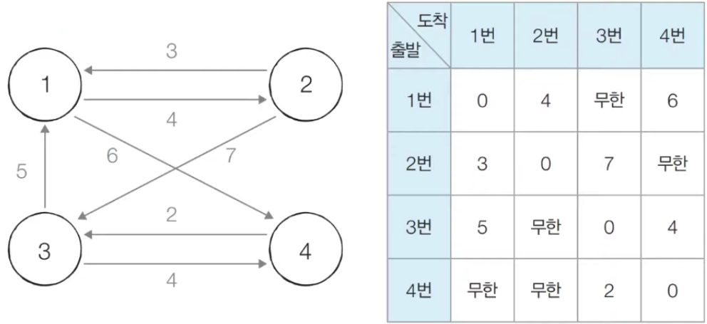
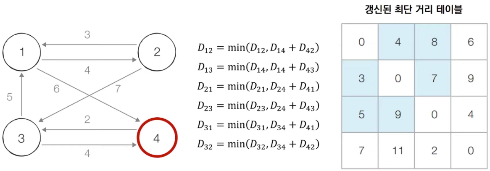

# 플로이드 워셜
모든 노드에서 다른 모든 노드까지의 최단 경로를 모두 계산하는 알고리즘.

## 구현



행렬에 간선 값을 초기화한 후 최단 거리 정보를 저장한다. 다이나믹 프로그래밍 유형으로 각 단계마다 특정한 노드를 거쳐가는 경우와 거쳐가지 않는 경우를 비교하며 점화식은 `D_ab = min(D_ab, D_ak + D_kb)` 와 같다.



## 코드
```python
INF = 987654321

# 노드의 개수 및 간선의 개수를 입력받기
# n, e = (4, 7)
n, e = map(int, input().split())

# 행렬을 만들고, 모든 값을 무한으로 초기화
graph = [[INF] * (n + 1) for _ in range(n + 1)]

# 자기 자신에서 자기 자신으로 가는 비용은 0으로 초기화
for a in range(1, n + 1):
    for b in range(1, n + 1):
        if a == b:
            graph[a][b] = 0

# 각 간선에 대한 정보를 입력 받아, 그 값으로 초기화
# graph[1][2] = 4
# graph[1][4] = 6
# graph[2][1] = 3
# graph[2][3] = 7
# graph[3][1] = 5
# graph[3][4] = 4
# graph[4][3] = 2
for _ in range(e):
    # A에서 B로 가는 비용은 C라고 설정
    a, b, c = map(int, input().split())
    graph[a][b] = c

# 점화식에 따라 플로이드 워셜 알고리즘을 수행
for k in range(1, n + 1):
    for a in range(1, n + 1):
        for b in range(1, n + 1):
            graph[a][b] = min(graph[a][b], graph[a][k] + graph[k][b])

# 수행된 결과를 출력
for a in range(1, n + 1):
    for b in range(1, n + 1):
        # 도달할 수 없는 경우, 무한(INFINITY)이라고 출력
        if graph[a][b] == 1e9:
            print("INFINITY", end=" ")
        # 도달할 수 있는 경우 거리를 출력
        else:
            print(graph[a][b], end=" ")
    print()
```